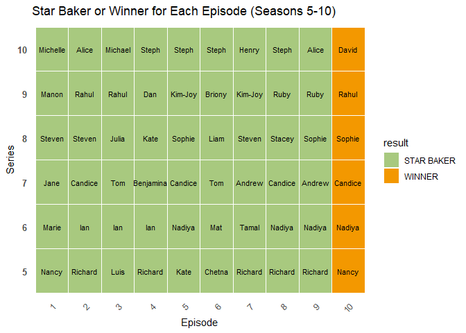

p8105_hw2_xx2485
================
Xiaoni Xu
2024-09-25

Loading needed packages:

``` r
library(tidyverse)
library(readxl)
library(ggplot2)
```

## Problem 1

Loading and cleaning the NYC transit data; convert the entry variable
from character to a logical variable.

``` r
transit_df <- 
  read_csv("data/NYC_Transit_Subway_Entrance_And_Exit_Data.csv") %>% 
  janitor::clean_names() %>% 
  select(line, station_name, station_latitude, station_longitude, route1:route11, entry, vending, entrance_type, ada) %>% 
  mutate(entry = ifelse(entry == "YES", TRUE, FALSE))
```

    ## Rows: 1868 Columns: 32
    ## ── Column specification ────────────────────────────────────────────────────────
    ## Delimiter: ","
    ## chr (22): Division, Line, Station Name, Route1, Route2, Route3, Route4, Rout...
    ## dbl  (8): Station Latitude, Station Longitude, Route8, Route9, Route10, Rout...
    ## lgl  (2): ADA, Free Crossover
    ## 
    ## ℹ Use `spec()` to retrieve the full column specification for this data.
    ## ℹ Specify the column types or set `show_col_types = FALSE` to quiet this message.

This dataset contains the information for every entrance of every subway
station of NYC. I chose a number of categories of data from the original
dataset, including line, station name, station latitude/longitude,
route, entry, vending, entrance type, and ADA compliance. The dimension
of the dataset after cleaning is 1868 rows x 19 columns. The data is not
quite tidy because `vending` variable is still a YES/NO character
variable, the route variable is difficult to understand, and each
entrance of the same station is not given a proper way to identify them.

Count distinct stations by both station name and line:

``` r
distinct_stations <- transit_df %>%
  distinct(station_name, line) %>%
  count()

# View the count of distinct stations
print(distinct_stations)
```

    ## # A tibble: 1 × 1
    ##       n
    ##   <int>
    ## 1   465

There are 465 distinct stations.

Count ADA-compliant stations

``` r
ada_compliant_count <- transit_df %>%
  filter(ada == TRUE) %>%
  distinct(station_name, line) %>%
  count()

# View the count
print(ada_compliant_count)
```

    ## # A tibble: 1 × 1
    ##       n
    ##   <int>
    ## 1    84

There are 84 distinct stations that are ADA compliant.

Calculate the proportion of station entrances / exits without vending
allow entrance

``` r
# Filter for stations without vending and count those allowing entrance
proportion_no_vending_entry <- transit_df %>%
  filter(vending == "NO") %>%    # Select stations with no vending
  summarise(proportion = mean(entry == "TRUE"))  # Calculate the proportion allowing entry

# View the result
print(proportion_no_vending_entry)
```

    ## # A tibble: 1 × 1
    ##   proportion
    ##        <dbl>
    ## 1      0.377

The proportion of station entrances / exits without vending allow
entrance is 0.3770492.

Reformat the data so that route number and route name are distinct

``` r
transit_df_reformat <- transit_df %>%
  mutate(across(starts_with("route"), as.character)) %>%   # Convert all route columns to character
  pivot_longer(cols = starts_with("route"), # Select all columns that start with 'Route'
               names_to = "route_number",    # Create a new column for the route number
               values_to = "route_name",     # Create a new column for the route name
               values_drop_na = TRUE)        # Drop NA values
```

Find the number of distinct stations that serve the A train

``` r
# Filter for stations that serve the A train and count distinct stations
distinct_a_train_stations <- transit_df_reformat %>%
  filter(route_name == "A") %>%      
  distinct(station_name, line) %>%     
  count()

# View the count of distinct A train stations
print(distinct_a_train_stations)
```

    ## # A tibble: 1 × 1
    ##       n
    ##   <int>
    ## 1    60

There are 60 distinct stations that serve the A train.

Find the number of stations that serve the A train and are ADA compliant

``` r
# Filter for distinct ADA-compliant stations that serve the A train
ada_compliant_a_train_stations <- transit_df_reformat %>%
  filter(route_name == "A", ada == "TRUE") %>%  
  distinct(station_name, line) %>%             
  count()

# View the count of distinct ADA-compliant A train stations
print(ada_compliant_a_train_stations)
```

    ## # A tibble: 1 × 1
    ##       n
    ##   <int>
    ## 1    17

There are 17 stations that serve the A train and are ADA compliant.

## Problem 2

Read and clean the data

``` r
# Read and clean the Mr. Trash Wheel data
mr_trash_wheel_df = 
  read_excel("data/202309 Trash Wheel Collection Data.xlsx", 
             sheet = "Mr. Trash Wheel",
             col_names = TRUE) %>% # specify the sheet in the Excel file and to omit non-data entries
  janitor::clean_names() %>% # use reasonable variable names
  select(dumpster:homes_powered)%>% 
  filter(!is.na(dumpster)) %>% # Omit rows without dumpster-specific data
  mutate(sports_balls = as.integer(round(sports_balls))) %>%  # Round sports balls and convert to integer
  mutate(trash_wheel = "Mr. Trash Wheel",
         year = as.integer(year))  # Add identifier
```

    ## New names:
    ## • `` -> `...15`
    ## • `` -> `...16`

``` r
# Read and clean the Professor Trash Wheel data
professor_trash_wheel_df =
  read_excel("data/202309 Trash Wheel Collection Data.xlsx",
                                        sheet = "Professor Trash Wheel",
                                        col_names = TRUE) %>%
  janitor::clean_names() %>%
  select(dumpster:homes_powered) %>%
  filter(!is.na(dumpster)) %>%
  mutate(trash_wheel = "Professor Trash Wheel",
         year = as.integer(year))  # Add identifier

# Read and clean the Gwynnda Wheel data
gwynnda_df <- read_excel("data/202309 Trash Wheel Collection Data.xlsx",
                          sheet = "Gwynnda Trash Wheel",
                          col_names = TRUE) %>%
  janitor::clean_names() %>%
  select(dumpster:homes_powered) %>%
  filter(!is.na(dumpster)) %>%
  mutate(trash_wheel = "Gwynnda",
         year = as.integer(year))  # Add identifier

# Combine all datasets into a single tidy dataset
combined_trash_wheel_df <- bind_rows(mr_trash_wheel_df, 
                                      professor_trash_wheel_df, 
                                      gwynnda_df)

# Display the combined dataset
print(combined_trash_wheel_df)
```

    ## # A tibble: 845 × 15
    ##    dumpster month  year date                weight_tons volume_cubic_yards
    ##       <dbl> <chr> <int> <dttm>                    <dbl>              <dbl>
    ##  1        1 May    2014 2014-05-16 00:00:00        4.31                 18
    ##  2        2 May    2014 2014-05-16 00:00:00        2.74                 13
    ##  3        3 May    2014 2014-05-16 00:00:00        3.45                 15
    ##  4        4 May    2014 2014-05-17 00:00:00        3.1                  15
    ##  5        5 May    2014 2014-05-17 00:00:00        4.06                 18
    ##  6        6 May    2014 2014-05-20 00:00:00        2.71                 13
    ##  7        7 May    2014 2014-05-21 00:00:00        1.91                  8
    ##  8        8 May    2014 2014-05-28 00:00:00        3.7                  16
    ##  9        9 June   2014 2014-06-05 00:00:00        2.52                 14
    ## 10       10 June   2014 2014-06-11 00:00:00        3.76                 18
    ## # ℹ 835 more rows
    ## # ℹ 9 more variables: plastic_bottles <dbl>, polystyrene <dbl>,
    ## #   cigarette_butts <dbl>, glass_bottles <dbl>, plastic_bags <dbl>,
    ## #   wrappers <dbl>, sports_balls <int>, homes_powered <dbl>, trash_wheel <chr>

The `combined_trash_wheel_df` dataframe combines the data from three
different trash wheels of Healthy Harbor company from the year 2014 to
2023, if data is available. The data includes the number of dumpster,
date, weight, volumes, types of trash collected, and homes powered. The
combined dataset has 845 rows, with 584 in the Mr. Trash Wheel dataset,
106 in the Professor Trash Wheel dataset, and 155 in the Gwynnda Trash
Wheel dataset.

Calculate the total weight of trash collected by Professor Trash Wheel

``` r
# Filter for Professor Trash Wheel and pull the weight column
total_weight_professor <- sum(
  combined_trash_wheel_df[combined_trash_wheel_df$trash_wheel == "Professor Trash Wheel", ] %>%
    pull(weight_tons),
  na.rm = TRUE
)

# Display the result
print(total_weight_professor)
```

    ## [1] 216.26

The total weight of trash collected by Professor Trash Wheel is 216.26
tons.

Calculate the total number of cigarette butts collected by Gwynnda in
June of 2022

``` r
# Filter for Gwynnda in June 2022 and calculate the total cigarette butts
total_cigarette_butts_gwynnda <- combined_trash_wheel_df %>%
  filter(trash_wheel == "Gwynnda" & year == 2022 & month == "June") %>%  
  pull(cigarette_butts) %>%  # Extract the cigarette_butts column
  sum(na.rm = TRUE)  # Calculate the total, ignoring NA values

# Display the result
print(total_cigarette_butts_gwynnda)
```

    ## [1] 18120

The total number of cigarette butts collected by Gwynnda in June of 2022
is 18120.

## Problem 3

Import all datasets of the Great British Bake Off

``` r
# Import data starting from the 4th row
results <- read_csv("data/gbb_datasets/results.csv", 
                 skip = 2)  # Skip the first 3 rows
```

    ## Rows: 1136 Columns: 5
    ## ── Column specification ────────────────────────────────────────────────────────
    ## Delimiter: ","
    ## chr (2): baker, result
    ## dbl (3): series, episode, technical
    ## 
    ## ℹ Use `spec()` to retrieve the full column specification for this data.
    ## ℹ Specify the column types or set `show_col_types = FALSE` to quiet this message.

``` r
bakes <- read_csv("data/gbb_datasets/bakes.csv") %>% 
  janitor::clean_names()
```

    ## Rows: 548 Columns: 5
    ## ── Column specification ────────────────────────────────────────────────────────
    ## Delimiter: ","
    ## chr (3): Baker, Signature Bake, Show Stopper
    ## dbl (2): Series, Episode
    ## 
    ## ℹ Use `spec()` to retrieve the full column specification for this data.
    ## ℹ Specify the column types or set `show_col_types = FALSE` to quiet this message.

``` r
bakers <- read_csv("data/gbb_datasets/bakers.csv") %>% 
  janitor::clean_names()
```

    ## Rows: 120 Columns: 5
    ## ── Column specification ────────────────────────────────────────────────────────
    ## Delimiter: ","
    ## chr (3): Baker Name, Baker Occupation, Hometown
    ## dbl (2): Series, Baker Age
    ## 
    ## ℹ Use `spec()` to retrieve the full column specification for this data.
    ## ℹ Specify the column types or set `show_col_types = FALSE` to quiet this message.

``` r
viewers <- read_csv("data/gbb_datasets/viewers.csv") %>% 
  janitor::clean_names()
```

    ## Rows: 10 Columns: 11
    ## ── Column specification ────────────────────────────────────────────────────────
    ## Delimiter: ","
    ## dbl (11): Episode, Series 1, Series 2, Series 3, Series 4, Series 5, Series ...
    ## 
    ## ℹ Use `spec()` to retrieve the full column specification for this data.
    ## ℹ Specify the column types or set `show_col_types = FALSE` to quiet this message.

Preparing the data for merging

``` r
# Create a new column in `bakers` to extract the first name
bakers <- bakers %>%
  mutate(first_name = word(baker_name, 1))  # Extract the first word (first name) from `baker_name`

# Reshape the `viewers` dataframe to a long format
viewers_long <- viewers %>%
  pivot_longer(cols = starts_with("series_"), 
               names_to = "series", 
               names_prefix = "series_", 
               values_to = "viewers") %>%
  mutate(series = as.integer(series))
```

Merging the dataframes

``` r
# Merge the two dataframes `results` and `bakes based on the three columns
merged_data <- merge(results, bakes, by = c("series", "episode", "baker"), all = TRUE) %>% # merge datasheets 'results' and 'bakes'
  mutate(baker = ifelse(baker == "\"Jo\"", "Jo", baker)) %>% # cleaning all `"Jo"` entries and prepare it for the next merge 
  left_join(bakers, by = c("baker" = "first_name", "series" = "series")) %>% # Merge `merged_data` with `bakers` based on `baker` and `series`
  left_join(viewers_long, by = c("series", "episode")) # Merge the reshaped `viewers_long` with `final_data` based on `series` and `episode`
```

Check for correctness across datasets using `anti_join`

``` r
# Find rows in `merged_data` that do not have a match in `viewers_long`
unmatched_in_merged <- merged_data %>%
  anti_join(viewers_long, by = c("series", "episode"))

unmatched_in_merged
```

    ##  [1] series           episode          baker            technical       
    ##  [5] result           signature_bake   show_stopper     baker_name      
    ##  [9] baker_age        baker_occupation hometown         viewers         
    ## <0 rows> (or 0-length row.names)

If the output is 0 rows, it means that we have no mismathes.

Organize the variables

``` r
# Rename `baker_name` to `baker_full_name` and rearrange columns
merged_data <- merged_data %>%
  rename(baker_full_name = baker_name) %>%  # Rename `baker_name` to `baker_full_name`
  select(series, episode, baker, baker_full_name, baker_age, baker_occupation, 
         hometown, signature_bake, show_stopper, technical, result, viewers)  # Rearrange columns
```

I rearranged the columns of the dataframe so it follows the flow of 1)
episode, 2) baker’s personal information, 3) baker’s bake and result,
and 4) the viewership.

Export the modified dataframe as a CSV file

``` r
write.csv(merged_data, file = file.path("C:/Users/berns/Desktop/P8105 Data Science I/p8105_hw2_xx2485/p8105_hw2_xx2485/data/gbb_datasets", "merged_data.csv"), row.names = FALSE)
```

For the data cleaning process, I followed the steps shown below: \*
Importing CSV files: The initial datasets (results, bakes, and viewers)
were imported using functions such as read_csv().

- Skipped unnecessary rows: For some datasets, I skipped the first few
  rows to remove notes that were not relevant to the analysis.

- Standardizing Column Names: Used functions like janitor::clean_names()
  to standardize column names, ensuring consistency across different
  datasets. Later, I changed column names using base R functions (e.g.,
  renaming baker_name to baker_full_name)t.

- Merging datasheets: I merged datasheets `results` and `bakes` based on
  the columns series, episode, and baker. `bakers` is merged based on
  the first names and series. The `viewers` dataset was in a wide format
  with columns like series_1, series_2, etc. To match the series and
  episode information, this dataset was reshaped into a long format
  using pivot_longer() to create a series and viewers column so it can
  also be merged into one single `merged_data` datasheet.

- Fixing Incompatible Data Types: I encountered data type mismatches of
  `series` being a character in one dataset and a numeric type in
  another. To resolve this, I converted the `series` column to a common
  data type (integer) in both datasets before merging.

The final dataset is a tidy format containing key information about
bakers, their performance in various series and episodes, their
demographic details, their bakes (signature, technical, show-stopper),
and viewership. By combining results, bakes, and viewers, the dataset
allows for comprehensive analysis, of the bakers’ background,
performance, and viewership engagement. The NA values and data not
included in the final dataset might influence the analysis of the data.

Create a reader-friendly table showing the star baker or winner of each
episode in Seasons 5 through 10

``` r
# Filter the dataset for seasons 5 through 10 and episodes with a "Star Baker" or winner
star_bakers_winners <- merged_data %>%
  filter(series >= 5, series <= 10, result %in% c("STAR BAKER", "WINNER")) %>%
  select(series, episode, baker) %>%
  arrange(series, episode)


# Create a table plot using ggplot2
ggplot(star_bakers_winners, aes(x = factor(episode), y = factor(series))) +
  geom_tile(color = "black", fill = "white") +  # Creates the table cell rectangles
  geom_text(aes(label = baker), size = 4, color = "black") +  # Add baker names as text
  labs(x = "Episode", y = "Series", title = "Star Baker or Winner for Each Episode (Seasons 5-10)") +
  theme_minimal() +
  theme(
    panel.grid = element_blank(),  # Remove grid lines for a cleaner look
    axis.text.x = element_text(angle = 45, hjust = 1),  # Rotate x-axis labels for readability
    axis.text.y = element_text(face = "bold")  # Make y-axis labels bold
  )
```

<!-- --> \*
Season 5: Richard stands out with five wins (Episodes 2, 4, 7, 8, and
9), who is the predicted winner. However, despite Richard’s multiple
wins, the overall winner of Season 5 was Nancy, who only won Episodes 1
and 10.

- Season 6: Nadiya won four episodes (Episodes 5, 8, 9, and 10), who is
  the predicted winner, and became the overall winner.

- Season 7: Candice won four episodes (Episodes 2, 5, 8, and 10), who is
  the predicted winner, and became the overall winner.

- Season 8: Steven and Sophie each had three wins, making predicting the
  winner difficult. The overall winner was Sophie.

- Season 9: Rahul is the predictable winner, with three wins (Episodes
  2, 3, and 10). He became the overall winner.

- Season 10: Steph is the predictable winner, with four wins (Episodes
  4, 5, 6, and 8). However, the overall winner was David, who only won
  the final episode (Episode 10).

Import, clean, tidy, and organize the viewership data in viewership.csv.
Show the first 10 rows of this dataset. What was the average viewership
in Season 1? In Season 5?
