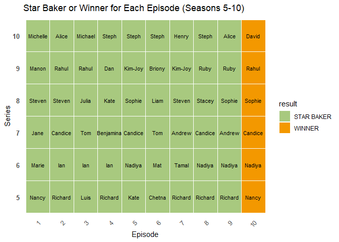
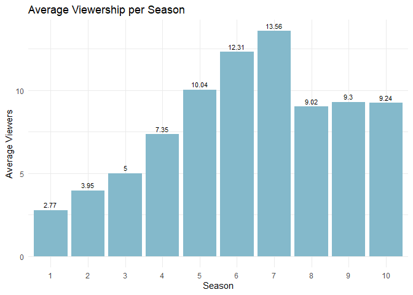

p8105_hw2_xx2485
================
Xiaoni Xu
2024-09-25

Loading needed packages:

``` r
library(tidyverse)
library(readxl)
library(ggplot2)
```

## Problem 1

**Loading and cleaning the NYC transit data; convert the entry variable
from character to a logical variable**

``` r
transit_df <- 
  read_csv("data/NYC_Transit_Subway_Entrance_And_Exit_Data.csv") %>% 
  janitor::clean_names() %>% 
  select(line, station_name, station_latitude, station_longitude, route1:route11, entry, vending, entrance_type, ada) %>% 
  mutate(entry = ifelse(entry == "YES", TRUE, FALSE))
```

    ## Rows: 1868 Columns: 32
    ## ── Column specification ────────────────────────────────────────────────────────
    ## Delimiter: ","
    ## chr (22): Division, Line, Station Name, Route1, Route2, Route3, Route4, Rout...
    ## dbl  (8): Station Latitude, Station Longitude, Route8, Route9, Route10, Rout...
    ## lgl  (2): ADA, Free Crossover
    ## 
    ## ℹ Use `spec()` to retrieve the full column specification for this data.
    ## ℹ Specify the column types or set `show_col_types = FALSE` to quiet this message.

This dataset contains the information for every entrance of every subway
station of NYC. I chose a number of categories of data from the original
dataset, including line, station name, station latitude/longitude,
route, entry, vending, entrance type, and ADA compliance. The dimension
of the dataset after cleaning is 1868 \* 19 (row \* columns). Column
names are renamed in a way to make them easier for coding.

The data is not quite tidy because `vending` variable is still a YES/NO
character variable, the route variable is difficult to understand, and
each entrance of the same station is not given a proper way to identify
them.

**Count distinct stations by both station name and line**

``` r
distinct_stations <- transit_df %>%
  distinct(station_name, line) %>%
  count()

# View the count of distinct stations
print(distinct_stations)
```

    ## # A tibble: 1 × 1
    ##       n
    ##   <int>
    ## 1   465

There are 465 distinct stations.

**Count ADA-compliant stations**

``` r
ada_compliant_count <- transit_df %>%
  filter(ada == TRUE) %>%
  distinct(station_name, line) %>%
  count()

# View the count
print(ada_compliant_count)
```

    ## # A tibble: 1 × 1
    ##       n
    ##   <int>
    ## 1    84

There are 84 distinct stations that are ADA compliant.

**Calculate the proportion of station entrances / exits without vending
allow entrance**

``` r
# Filter for stations without vending and count those allowing entrance
proportion_no_vending_entry <- transit_df %>%
  filter(vending == "NO") %>%    # Select stations with no vending
  summarise(proportion = mean(entry == "TRUE"))  # Calculate the proportion allowing entry

# View the result
print(proportion_no_vending_entry)
```

    ## # A tibble: 1 × 1
    ##   proportion
    ##        <dbl>
    ## 1      0.377

The proportion of station entrances / exits without vending allow
entrance is 37.7%.

**Reformat the data so that route number and route name are distinct**

``` r
transit_df_reformat <- transit_df %>%
  mutate(across(starts_with("route"), as.character)) %>%   # Convert all route columns to character
  pivot_longer(cols = starts_with("route"), # Select all columns that start with 'Route'
               names_to = "route_number",    # Create a new column for the route number
               values_to = "route_name",     # Create a new column for the route name
               values_drop_na = TRUE)        # Drop NA values
```

**Find the number of distinct stations that serve the A train**

``` r
# Filter for stations that serve the A train and count distinct stations
distinct_a_train_stations <- transit_df_reformat %>%
  filter(route_name == "A") %>%      
  distinct(station_name, line) %>%     
  count()

# View the count of distinct A train stations
print(distinct_a_train_stations)
```

    ## # A tibble: 1 × 1
    ##       n
    ##   <int>
    ## 1    60

There are 60 distinct stations that serve the A train.

**Find the number of stations that serve the A train and are ADA
compliant**

``` r
# Filter for distinct ADA-compliant stations that serve the A train
ada_compliant_a_train_stations <- transit_df_reformat %>%
  filter(route_name == "A", ada == "TRUE") %>%  
  distinct(station_name, line) %>%             
  count()

# View the count of distinct ADA-compliant A train stations
print(ada_compliant_a_train_stations)
```

    ## # A tibble: 1 × 1
    ##       n
    ##   <int>
    ## 1    17

There are 17 stations that serve the A train and are ADA compliant.

## Problem 2

**Read and clean the data**

``` r
# Read and clean the Mr. Trash Wheel data
mr_trash_wheel_df = 
  read_excel("data/202409 Trash Wheel Collection Data.xlsx", 
             sheet = "Mr. Trash Wheel",
             col_names = TRUE) %>% # specify the sheet in the Excel file and to omit non-data entries
  janitor::clean_names() %>% # use reasonable variable names
  select(dumpster:homes_powered)%>% 
  filter(!is.na(dumpster)) %>% # Omit rows without dumpster-specific data
  mutate(sports_balls = as.integer(round(sports_balls))) %>%  # Round sports balls and convert to integer
  mutate(trash_wheel = "Mr. Trash Wheel",
         year = as.integer(year),# Add identifier
         homes_powered = (weight_tons * 500 / 30))  
```

    ## New names:
    ## • `` -> `...15`
    ## • `` -> `...16`

``` r
# Read and clean the Professor Trash Wheel data
professor_trash_wheel_df =
  read_excel("data/202409 Trash Wheel Collection Data.xlsx",
                                        sheet = "Professor Trash Wheel",
                                        col_names = TRUE) %>%
  janitor::clean_names() %>%
  select(dumpster:homes_powered) %>%
  filter(!is.na(dumpster)) %>%
  mutate(trash_wheel = "Professor Trash Wheel",
         year = as.integer(year),
         homes_powered = (weight_tons * 500 / 30))

# Read and clean the Gwynnda Wheel data
gwynnda_df <- read_excel("data/202409 Trash Wheel Collection Data.xlsx",
                          sheet = "Gwynnda Trash Wheel",
                          col_names = TRUE) %>%
  janitor::clean_names() %>%
  select(dumpster:homes_powered) %>%
  filter(!is.na(dumpster)) %>%
  mutate(trash_wheel = "Gwynnda",
         year = as.integer(year),
         homes_powered = (weight_tons * 500 / 30))

# Combine all datasets into a single tidy dataset
combined_trash_wheel_df <- bind_rows(mr_trash_wheel_df, 
                                      professor_trash_wheel_df, 
                                      gwynnda_df)

# Display the combined dataset
print(combined_trash_wheel_df)
```

    ## # A tibble: 1,033 × 15
    ##    dumpster month  year date                weight_tons volume_cubic_yards
    ##       <dbl> <chr> <int> <dttm>                    <dbl>              <dbl>
    ##  1        1 May    2014 2014-05-16 00:00:00        4.31                 18
    ##  2        2 May    2014 2014-05-16 00:00:00        2.74                 13
    ##  3        3 May    2014 2014-05-16 00:00:00        3.45                 15
    ##  4        4 May    2014 2014-05-17 00:00:00        3.1                  15
    ##  5        5 May    2014 2014-05-17 00:00:00        4.06                 18
    ##  6        6 May    2014 2014-05-20 00:00:00        2.71                 13
    ##  7        7 May    2014 2014-05-21 00:00:00        1.91                  8
    ##  8        8 May    2014 2014-05-28 00:00:00        3.7                  16
    ##  9        9 June   2014 2014-06-05 00:00:00        2.52                 14
    ## 10       10 June   2014 2014-06-11 00:00:00        3.76                 18
    ## # ℹ 1,023 more rows
    ## # ℹ 9 more variables: plastic_bottles <dbl>, polystyrene <dbl>,
    ## #   cigarette_butts <dbl>, glass_bottles <dbl>, plastic_bags <dbl>,
    ## #   wrappers <dbl>, sports_balls <int>, homes_powered <dbl>, trash_wheel <chr>

``` r
summary(combined_trash_wheel_df)
```

    ##     dumpster        month                year     
    ##  Min.   :  1.0   Length:1033        Min.   :2014  
    ##  1st Qu.: 86.0   Class :character   1st Qu.:2018  
    ##  Median :199.0   Mode  :character   Median :2020  
    ##  Mean   :245.7                      Mean   :2020  
    ##  3rd Qu.:393.0                      3rd Qu.:2022  
    ##  Max.   :651.0                      Max.   :2024  
    ##                                     NA's   :1     
    ##       date                        weight_tons    volume_cubic_yards
    ##  Min.   :2014-05-16 00:00:00.0   Min.   :0.610   Min.   : 5.00     
    ##  1st Qu.:2018-04-16 00:00:00.0   1st Qu.:2.540   1st Qu.:15.00     
    ##  Median :2020-12-26 00:00:00.0   Median :3.080   Median :15.00     
    ##  Mean   :2020-05-11 15:06:58.5   Mean   :3.038   Mean   :15.08     
    ##  3rd Qu.:2022-11-04 18:00:00.0   3rd Qu.:3.553   3rd Qu.:15.00     
    ##  Max.   :2024-06-11 00:00:00.0   Max.   :5.620   Max.   :20.00     
    ##  NA's   :1                       NA's   :1       NA's   :1         
    ##  plastic_bottles  polystyrene    cigarette_butts  glass_bottles   
    ##  Min.   :   0    Min.   :    0   Min.   :     0   Min.   :  0.00  
    ##  1st Qu.: 980    1st Qu.:  230   1st Qu.:  2800   1st Qu.: 10.00  
    ##  Median :1900    Median :  640   Median :  4800   Median : 18.00  
    ##  Mean   :2201    Mean   : 1383   Mean   : 13296   Mean   : 20.92  
    ##  3rd Qu.:2900    3rd Qu.: 2045   3rd Qu.: 12000   3rd Qu.: 28.00  
    ##  Max.   :9830    Max.   :11528   Max.   :310000   Max.   :110.00  
    ##  NA's   :2       NA's   :2       NA's   :2        NA's   :265     
    ##   plastic_bags      wrappers      sports_balls   homes_powered  
    ##  Min.   :    0   Min.   :    0   Min.   : 0.00   Min.   :10.17  
    ##  1st Qu.:  220   1st Qu.:  900   1st Qu.: 6.00   1st Qu.:42.33  
    ##  Median :  470   Median : 1440   Median :12.00   Median :51.33  
    ##  Mean   :  927   Mean   : 2246   Mean   :13.98   Mean   :50.64  
    ##  3rd Qu.: 1115   3rd Qu.: 2580   3rd Qu.:20.00   3rd Qu.:59.21  
    ##  Max.   :13450   Max.   :20100   Max.   :56.00   Max.   :93.67  
    ##  NA's   :2       NA's   :119     NA's   :382     NA's   :1      
    ##  trash_wheel       
    ##  Length:1033       
    ##  Class :character  
    ##  Mode  :character  
    ##                    
    ##                    
    ##                    
    ## 

**Mr. Trash Wheel**:

``` r
summary(mr_trash_wheel_df)
```

    ##     dumpster        month                year     
    ##  Min.   :  1.0   Length:651         Min.   :2014  
    ##  1st Qu.:163.5   Class :character   1st Qu.:2016  
    ##  Median :326.0   Mode  :character   Median :2019  
    ##  Mean   :326.0                      Mean   :2019  
    ##  3rd Qu.:488.5                      3rd Qu.:2021  
    ##  Max.   :651.0                      Max.   :2024  
    ##       date                         weight_tons    volume_cubic_yards
    ##  Min.   :2014-05-16 00:00:00.00   Min.   :0.780   Min.   : 7.00     
    ##  1st Qu.:2016-12-03 12:00:00.00   1st Qu.:2.720   1st Qu.:15.00     
    ##  Median :2019-04-18 00:00:00.00   Median :3.200   Median :15.00     
    ##  Mean   :2019-04-16 09:39:32.34   Mean   :3.212   Mean   :15.24     
    ##  3rd Qu.:2021-09-02 00:00:00.00   3rd Qu.:3.725   3rd Qu.:15.00     
    ##  Max.   :2024-06-11 00:00:00.00   Max.   :5.620   Max.   :20.00     
    ##  plastic_bottles  polystyrene   cigarette_butts  glass_bottles   
    ##  Min.   :  80    Min.   :  20   Min.   :   500   Min.   :  0.00  
    ##  1st Qu.:1008    1st Qu.: 400   1st Qu.:  3600   1st Qu.: 10.00  
    ##  Median :1900    Median : 990   Median :  5600   Median : 18.00  
    ##  Mean   :1966    Mean   :1425   Mean   : 18136   Mean   : 21.37  
    ##  3rd Qu.:2735    3rd Qu.:2240   3rd Qu.: 21500   3rd Qu.: 29.00  
    ##  Max.   :5960    Max.   :6540   Max.   :310000   Max.   :110.00  
    ##   plastic_bags       wrappers     sports_balls   homes_powered  
    ##  Min.   :  24.0   Min.   : 180   Min.   : 0.00   Min.   :13.00  
    ##  1st Qu.: 265.0   1st Qu.: 780   1st Qu.: 6.00   1st Qu.:45.33  
    ##  Median : 510.0   Median :1200   Median :12.00   Median :53.33  
    ##  Mean   : 849.1   Mean   :1452   Mean   :13.98   Mean   :53.54  
    ##  3rd Qu.:1120.0   3rd Qu.:2000   3rd Qu.:20.00   3rd Qu.:62.08  
    ##  Max.   :3750.0   Max.   :5085   Max.   :56.00   Max.   :93.67  
    ##  trash_wheel       
    ##  Length:651        
    ##  Class :character  
    ##  Mode  :character  
    ##                    
    ##                    
    ## 

- The dataset contains 651 observations and 15 categories for data. The
  data was collected from years 2014, 2015, 2016, 2017, 2018, 2019,
  2020, 2021, 2022, 2023, 2024, with the number of observations in each
  year being: 44, 71, 51, 55, 93, 66, 72, 58, 57, 62, 22.

- The weight of trash collected by Mr. Trash Wheel dumpsters ranges from
  0.78 tons to 5.62 tons, with an average of 3.21 tons per dumpster.
  Cumulatively, Mr. Trash Wheel has collected 2091.18 tons of trash.

- The volume of trash ranges from 7 to 20 cubic yards, averaging 15.24
  cubic yards per dumpster, totaling approximately 9919 cubic yards of
  trash.

- Plastic Bottles: An average of 1966, bottles per dumpster, with a
  cumulative total of approximately 1280075 plastic bottles.

- Polystyrene: An average of 1425 units per dumpster, totaling
  approximately 927411 units collected.

- Cigarette Butts: Each dumpster collects an average of 1.8136^{4}
  butts, summing up to approximately 11806700 cigarette butts.

- Glass Bottles: An average of 21 bottles per dumpster, resulting in a
  total of approximately 13913 glass bottles.

- Plastic Bags: An average of 849, bags per dumpster, amounting to
  approximately 552734 plastic bags.

- Wrappers: An average of 1452 wrappers per dumpster, with a cumulative
  total of approximately 945129 wrappers.

- Sports Balls: An average of 14 balls per dumpster, with a cumulative
  total of approximately 9098 balls.

- Each dumpster powers an average of 53.54 homes, with a cumulative
  total of approximately 3.4853^{4} homes powered by the collected
  trash.

**Professor Trash Wheel**:

``` r
summary(professor_trash_wheel_df)
```

    ##     dumpster        month                year     
    ##  Min.   :  1.0   Length:119         Min.   :2017  
    ##  1st Qu.: 30.5   Class :character   1st Qu.:2018  
    ##  Median : 60.0   Mode  :character   Median :2020  
    ##  Mean   : 60.0                      Mean   :2020  
    ##  3rd Qu.: 89.5                      3rd Qu.:2022  
    ##  Max.   :119.0                      Max.   :2024  
    ##                                     NA's   :1     
    ##       date                         weight_tons    volume_cubic_yards
    ##  Min.   :2017-01-02 00:00:00.00   Min.   :0.610   Min.   : 6.00     
    ##  1st Qu.:2018-06-24 00:00:00.00   1st Qu.:1.637   1st Qu.:15.00     
    ##  Median :2020-03-05 12:00:00.00   Median :2.000   Median :15.00     
    ##  Mean   :2020-05-06 07:19:19.31   Mean   :2.091   Mean   :14.54     
    ##  3rd Qu.:2022-04-03 18:00:00.00   3rd Qu.:2.535   3rd Qu.:15.00     
    ##  Max.   :2024-05-30 00:00:00.00   Max.   :3.750   Max.   :18.00     
    ##  NA's   :1                        NA's   :1       NA's   :1         
    ##  plastic_bottles  polystyrene    cigarette_butts glass_bottles  
    ##  Min.   : 657    Min.   :  180   Min.   : 3800   Min.   : 0.00  
    ##  1st Qu.:3600    1st Qu.:  640   1st Qu.: 6200   1st Qu.: 9.00  
    ##  Median :4800    Median : 3100   Median : 8380   Median :18.00  
    ##  Mean   :5070    Mean   : 3816   Mean   :10919   Mean   :18.38  
    ##  3rd Qu.:6800    3rd Qu.: 6400   3rd Qu.:14000   3rd Qu.:26.00  
    ##  Max.   :9830    Max.   :11528   Max.   :33320   Max.   :49.00  
    ##  NA's   :2       NA's   :2       NA's   :2       NA's   :2      
    ##   plastic_bags      wrappers     homes_powered   trash_wheel       
    ##  Min.   :  140   Min.   : 2300   Min.   :10.17   Length:119        
    ##  1st Qu.:  440   1st Qu.: 4300   1st Qu.:27.29   Class :character  
    ##  Median :  980   Median : 5500   Median :33.33   Mode  :character  
    ##  Mean   : 2219   Mean   : 7390   Mean   :34.85                     
    ##  3rd Qu.: 1800   3rd Qu.: 8800   3rd Qu.:42.25                     
    ##  Max.   :13450   Max.   :20100   Max.   :62.50                     
    ##  NA's   :2       NA's   :2       NA's   :1

- This dataset contains 14 variables and 119 observations (dumpsters).
  The data was collected over the years 2017, 2018, 2019, 2020, 2021,
  2022, 2023, 2024, NA, with the number of observations in each year
  being: 18, 24, 15, 13, 15, 16, 13, 4.

- The weight of trash collected by Professor Trash Wheel dumpsters
  ranges from 0.61 tons to 3.75 tons, with an average of 2.09 tons per
  dumpster. Cumulatively, Professor Trash Wheel has collected 246.74
  tons of trash.

- The volume of trash collected ranges from 6 cubic yards to 18 cubic
  yards, with an average of 14.54 cubic yards per dumpster. In total,
  the dumpsters have collected 1716 cubic yards of trash.

- For specific types of trash, the average number of plastic bottles
  collected per dumpster is 5070, and cumulatively, Professor Trash
  Wheel has collected 593246 plastic bottles.

- The average number of polystyrene collected is 3816, with a total of
  446455 units collected so far.

- For cigarette butts, each dumpster collects an average of 1.0919^{4},
  with a cumulative total of 1277478 cigarette butts collected.

- The average number of glass bottles per dumpster is 18, and
  cumulatively, Professor Trash Wheel has collected 2151 glass bottles.

- The average number of plastic bags collected per dumpster is 2219, and
  cumulatively, the trash wheel has collected 259674 plastic bags.

- Each dumpster collects an average of 7390 wrappers, with a cumulative
  total of 864682 wrappers collected.

- Regarding energy, on average, each dumpster powers the equivalent of
  34.85 homes, with a cumulative total of 4112.33 homes powered by the
  collected trash.

**Gwynnda the Good Wheel of the West**:

``` r
summary(gwynnda_df)
```

    ##     dumpster        month                year     
    ##  Min.   :  1.0   Length:263         Min.   :2021  
    ##  1st Qu.: 65.5   Class :character   1st Qu.:2022  
    ##  Median :131.0   Mode  :character   Median :2022  
    ##  Mean   :131.1                      Mean   :2022  
    ##  3rd Qu.:196.5                      3rd Qu.:2023  
    ##  Max.   :262.0                      Max.   :2024  
    ##                                                   
    ##       date                         weight_tons    volume_cubic_yards
    ##  Min.   :2021-07-03 00:00:00.00   Min.   :0.770   Min.   : 5.00     
    ##  1st Qu.:2022-04-22 12:00:00.00   1st Qu.:2.700   1st Qu.:15.00     
    ##  Median :2022-12-30 00:00:00.00   Median :3.080   Median :15.00     
    ##  Mean   :2023-01-07 10:02:16.88   Mean   :3.033   Mean   :14.92     
    ##  3rd Qu.:2023-11-29 12:00:00.00   3rd Qu.:3.445   3rd Qu.:15.00     
    ##  Max.   :2024-06-07 00:00:00.00   Max.   :4.240   Max.   :15.00     
    ##                                                                     
    ##  plastic_bottles  polystyrene    cigarette_butts  plastic_bags   
    ##  Min.   :   0    Min.   :  0.0   Min.   :   0    Min.   :   0.0  
    ##  1st Qu.: 720    1st Qu.: 82.0   1st Qu.:1200    1st Qu.: 120.0  
    ##  Median :1200    Median :190.0   Median :2200    Median : 240.0  
    ##  Mean   :1507    Mean   :197.9   Mean   :2372    Mean   : 545.1  
    ##  3rd Qu.:2100    3rd Qu.:275.0   3rd Qu.:3300    3rd Qu.: 640.0  
    ##  Max.   :5400    Max.   :640.0   Max.   :6400    Max.   :3600.0  
    ##                                                                  
    ##     wrappers    homes_powered   trash_wheel       
    ##  Min.   :   0   Min.   :12.83   Length:263        
    ##  1st Qu.: 980   1st Qu.:45.00   Class :character  
    ##  Median :1600   Median :51.33   Mode  :character  
    ##  Mean   :1666   Mean   :50.54                     
    ##  3rd Qu.:2100   3rd Qu.:57.42                     
    ##  Max.   :4900   Max.   :70.67                     
    ##  NA's   :117

- This dataset contains 13 variables and 263 observations (dumpsters).
  The data was collected over the years 2021, 2022, 2023, 2024, with the
  number of observations in each year being: 49, 85, 86, 43.

- The weight of trash collected by Gwynnda Trash Wheel dumpsters ranges
  from 0.77 tons to 4.24 tons, with an average of 3.03 tons per
  dumpster. Cumulatively, Gwynnda Trash Wheel has collected 797.55 tons
  of trash.

- The volume of trash collected ranges from 5 cubic yards to 15 cubic
  yards, with an average of 14.92 cubic yards per dumpster. In total,
  the dumpsters have collected 3924 cubic yards of trash.

- For specific types of trash, the average number of plastic bottles
  collected per dumpster is 1507, and cumulatively, Gwynnda Trash Wheel
  has collected 396227 plastic bottles.

- The average number of polystyrene collected is 198, with a total of
  52054 units collected so far.

- For cigarette butts, each dumpster collects an average of 2372, with a
  cumulative total of 623920 cigarette butts collected.

- The average number of plastic bags per dumpster is 545, and
  cumulatively, the trash wheel has collected 143365 plastic bags.

- Each dumpster collects an average of 1666 wrappers, with a cumulative
  total of 243290 wrappers collected.

- Regarding energy, on average, each dumpster powers the equivalent of
  50.54 homes, with a cumulative total of 1.32925^{4} homes powered by
  the collected trash.

**Calculate the total weight of trash collected by Professor Trash
Wheel**

``` r
# Filter for Professor Trash Wheel and pull the weight column
total_weight_professor <- sum(
  combined_trash_wheel_df[combined_trash_wheel_df$trash_wheel == "Professor Trash Wheel", ] %>%
    pull(weight_tons),
  na.rm = TRUE
)

# Display the result
print(total_weight_professor)
```

    ## [1] 246.74

The total weight of trash collected by Professor Trash Wheel is 246.74
tons.

**Calculate the total number of cigarette butts collected by Gwynnda in
June of 2022**

``` r
# Filter for Gwynnda in June 2022 and calculate the total cigarette butts
total_cigarette_butts_gwynnda <- combined_trash_wheel_df %>%
  filter(trash_wheel == "Gwynnda" & year == 2022 & month == "June") %>%  
  pull(cigarette_butts) %>%  # Extract the cigarette_butts column
  sum(na.rm = TRUE)  # Calculate the total, ignoring NA values

# Display the result
print(total_cigarette_butts_gwynnda)
```

    ## [1] 18120

The total number of cigarette butts collected by Gwynnda in June of 2022
is 18120.

## Problem 3

**Import all datasets of the Great British Bake Off**

``` r
# Import data starting from the 4th row
results <- read_csv("data/gbb_datasets/results.csv", 
                 skip = 2) %>%   # Skip the first 3 rows
   mutate(baker = ifelse(baker == "Joanne", "Jo", baker)) # Joanne is the same person as Jo

bakes <- read_csv("data/gbb_datasets/bakes.csv") %>% 
  janitor::clean_names() %>% 
  mutate(baker = ifelse(baker == "\"Jo\"", "Jo", baker))  # cleaning all `"Jo"` entries and prepare it for the next merge 

bakers <- read_csv("data/gbb_datasets/bakers.csv") %>% 
  janitor::clean_names()

viewers <- read_csv("data/gbb_datasets/viewers.csv") %>% 
  janitor::clean_names()
```

**Preparing the data for merging**

``` r
# Create a new column in `bakers` to extract the first name
bakers <- bakers %>%
  mutate(first_name = word(baker_name, 1))  # Extract the first word (first name) from `baker_name`

# Reshape the `viewers` dataframe to a long format
viewers_long <- viewers %>%
  pivot_longer(cols = starts_with("series_"), 
               names_to = "series", 
               names_prefix = "series_", 
               values_to = "viewers") %>%
  mutate(series = as.integer(series))
```

**Merging the dataframes**

``` r
# Merge the two dataframes `results` and `bakes based on the three columns
merged_data <- merge(results, bakes, by = c("series", "episode", "baker"), all = TRUE) %>% # merge datasheets 'results' and 'bakes'
 
  left_join(bakers, by = c("baker" = "first_name", "series" = "series")) %>% # Merge `merged_data` with `bakers` based on `baker` and `series`
  left_join(viewers_long, by = c("series", "episode")) # Merge the reshaped `viewers_long` with `final_data` based on `series` and `episode`
```

**Check for correctness across datasets using `anti_join`**

``` r
# Find rows in merged_data that don't match viewers_long (by series and episode)
unmatched_in_merged_1 <- 
  merged_data %>%  
  anti_join(viewers_long, by = c("series", "episode"))  # Check for missing rows in viewers_long

# Find rows in merged_data that don't match bakers (by series and first_name)
unmatched_in_merged_2 <- 
  merged_data %>%  
  anti_join(bakers, by = c("baker" = "first_name", "series"))  # Correct column name for bakers

# Find rows in merged_data that don't match bakes (by series, episode, and baker)
unmatched_in_merged_3 <- 
  merged_data %>%  
  anti_join(bakes, by = c("series", "episode", "baker"))  # Check for missing rows in bakes

# Display the results
dim(unmatched_in_merged_1)
```

    ## [1]  0 12

``` r
dim(unmatched_in_merged_2)
```

    ## [1]  0 12

``` r
dim(unmatched_in_merged_3)
```

    ## [1] 588  12

The merges with viewers_long and bakers were fully successful, with no
mismatches or missing data. However, the data in `bakes` is incomplete
or inconsistent for 588 combinations of series, episode, and baker.

**Organize the variables**

``` r
# Rename `baker_name` to `baker_full_name` and rearrange columns
merged_data <- merged_data %>%
  rename(baker_full_name = baker_name) %>%  # Rename `baker_name` to `baker_full_name`
  select(series, episode, baker, baker_full_name, baker_age, baker_occupation, 
         hometown, signature_bake, show_stopper, technical, result, viewers)  # Rearrange columns
```

I rearranged the columns of the dataframe so it follows the flow of 1)
episode, 2) baker’s personal information, 3) baker’s bake and result,
and 4) the viewership.

**Export the modified dataframe as a CSV file**

``` r
write.csv(merged_data, file = file.path("C:/Users/berns/Desktop/P8105 Data Science I/p8105_hw2_xx2485/p8105_hw2_xx2485/data/gbb_datasets", "merged_data.csv"), row.names = FALSE)
```

For the data cleaning process, I followed the steps shown below:

- Importing CSV files: The initial datasets (results, bakes, and
  viewers) were imported using functions such as read_csv().

- Skipped unnecessary rows: For some datasets, I skipped the first few
  rows to remove notes that were not relevant to the analysis.

- Standardizing column names: Used functions like janitor::clean_names()
  to standardize column names, ensuring consistency across different
  datasets. Later, I changed column names using base R functions (e.g.,
  renaming baker_name to baker_full_name)t.

- Merging datasheets: I merged datasheets `results` and `bakes` based on
  the columns series, episode, and baker. `bakers` is merged based on
  the first names and series. The `viewers` dataset was in a wide format
  with columns like series_1, series_2, etc. To match the series and
  episode information, this dataset was reshaped into a long format
  using pivot_longer() to create a series and viewers column so it can
  also be merged into one single `merged_data` datasheet.

- Fixing incompatible data types: I encountered data type mismatches of
  `series` being a character in one dataset and a numeric type in
  another. To resolve this, I converted the `series` column to a common
  data type (integer) in both datasets before merging.

The final dataset is a tidy format containing key information about
bakers, their performance in various series and episodes, their
demographic details, their bakes (signature, technical, show-stopper),
and viewership. By combining results, bakes, and viewers, the dataset
allows for comprehensive analysis, of the bakers’ background,
performance, and viewership engagement. The NA values and data not
included in the final dataset might influence the analysis of the data.

**Create a reader-friendly table showing the star baker or winner of
each episode in Seasons 5 through 10**

``` r
# Filter the dataset for seasons 5 through 10 and episodes with a "Star Baker" or winner
star_bakers_winners <- merged_data %>%
  filter(series >= 5, series <= 10, result %in% c("STAR BAKER", "WINNER")) %>%
  select(series, episode, baker, result) %>%
  arrange(series, episode)


# Create a table plot using ggplot2
ggplot(star_bakers_winners, aes(x = factor(episode), y = factor(series))) +
  geom_tile(aes(fill = result), 
            color = "white") +  # Add a tile for each episode with color based on result
  geom_text(aes(label = baker), size = 3, color = "black") +  # Add baker names as text
  scale_fill_manual(values = c("STAR BAKER" = "#a8c97f", "WINNER" = "#f39800")) +  # Custom color scheme 
  labs(x = "Episode", y = "Series", title = "Star Baker or Winner for Each Episode (Seasons 5-10)") +
  theme_minimal() +
  theme(
    panel.grid = element_blank(),  # Remove grid lines for a cleaner look
    axis.text.x = element_text(angle = 45, hjust = 1),  # Rotate x-axis labels for readability
    axis.text.y = element_text(face = "bold", size = 10)  # Make y-axis labels bold
  )
```

<!-- -->

- Season 5: Richard stands out with five wins (Episodes 2, 4, 7, 8, and
  9), who is the predicted winner. However, despite Richard’s multiple
  wins, the overall winner of Season 5 was Nancy, who only won Episodes
  1 and 10.

- Season 6: Nadiya won four episodes (Episodes 5, 8, 9, and 10), who is
  the predicted winner, and became the overall winner.

- Season 7: Candice won four episodes (Episodes 2, 5, 8, and 10), who is
  the predicted winner, and became the overall winner.

- Season 8: Steven and Sophie each had three wins, making predicting the
  winner difficult. The overall winner was Sophie.

- Season 9: Rahul is the predictable winner, with three wins (Episodes
  2, 3, and 10). He became the overall winner.

- Season 10: Steph is the predictable winner, with four wins (Episodes
  4, 5, 6, and 8). However, the overall winner was David, who only won
  the final episode (Episode 10).

**Import, clean, tidy, and organize the viewership data**

``` r
# Show the first 10 rows of the cleaned and organized dataset
viewers_long %>%
  arrange(series, episode) %>%  # Sort by series and episode
  head(10) %>%
  print()
```

    ## # A tibble: 10 × 3
    ##    episode series viewers
    ##      <dbl>  <int>   <dbl>
    ##  1       1      1    2.24
    ##  2       2      1    3   
    ##  3       3      1    3   
    ##  4       4      1    2.6 
    ##  5       5      1    3.03
    ##  6       6      1    2.75
    ##  7       7      1   NA   
    ##  8       8      1   NA   
    ##  9       9      1   NA   
    ## 10      10      1   NA

``` r
# Calculate the average viewership, accounting for NA values
avg_viewership_by_season <- 
  viewers_long |>
  group_by(series) |>
  summarise(
    average_viewers = mean(viewers, na.rm = TRUE),
    episodes_count = n(),
    missing_count = sum(is.na(viewers))
  )

# Visualize the data quality and averages
ggplot(avg_viewership_by_season, 
       aes(x = factor(series),
           y = average_viewers)) +
  geom_col(fill = "#84b9cb") +
  geom_text(aes(label = round(average_viewers, 2)),
            vjust = -0.5, size = 3) +
  labs(title = "Average Viewership per Season", 
       x = "Season", 
       y = "Average Viewers") +
  theme_minimal()
```

<!-- -->

``` r
# Calculate the average viewership for Season 1
avg_viewership_season_1 <- viewers_long %>%
  filter(series == 1) %>%
  summarise(average_viewers = mean(viewers, na.rm = TRUE))

# Calculate the average viewership for Season 5
avg_viewership_season_5 <- viewers_long %>%
  filter(series == 5) %>%
  summarise(average_viewers = mean(viewers, na.rm = TRUE))

# Display the results

# the average viewership in Season 1
avg_viewership_season_1
```

    ## # A tibble: 1 × 1
    ##   average_viewers
    ##             <dbl>
    ## 1            2.77

``` r
# the average viewership in Season 5
avg_viewership_season_5
```

    ## # A tibble: 1 × 1
    ##   average_viewers
    ##             <dbl>
    ## 1            10.0

For Season 1, the average viewership was 2.77; for Season 5, the average
viewership was 10.0393.
